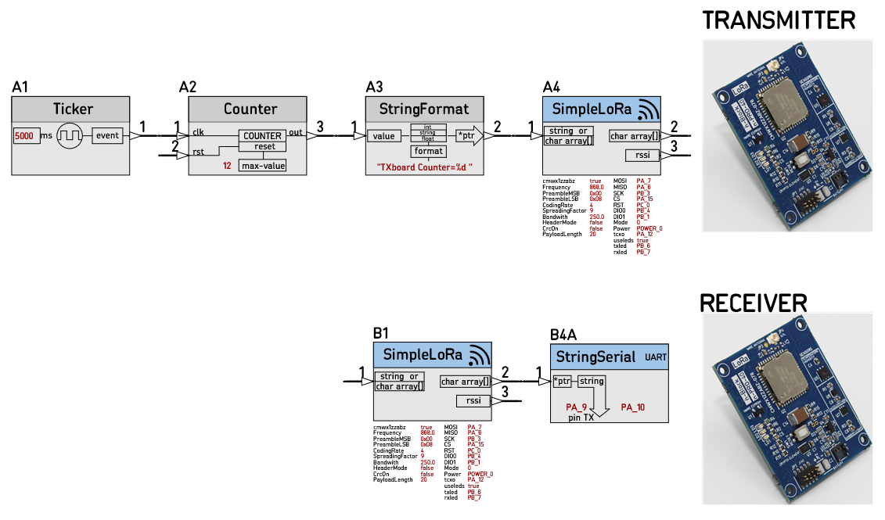

# 21D_SimpleLora_test
A project to test the Node [SimpleLoRa](https://github.com/nBlocksStudioNodes/nblocks_simplelora)

## Design
We are using a multi board Design: Nodes 'A' are for the transmitting board and Nodes 'B' for the Receiving board.
The Transmitting board sends a new couner value every 5sec and the Receiving board prints that value to the serial port.

## Setup
n-Blocks PRO series board allow fast and compact prototyping.
We are using 
 *  2x n-PRO-40 Lora boards
 *  2x n-PRO-24 pinstrip breakout boards
 *  1x n-PRO-DAP to connect the Receiver board to PC USB.

    

## Receiver 
Node B1 is connected to PC terminal  via the n-PRO-DAP board USB interface. The received characters are printed in the screen. In every transmission we see the next value of the transmitted Counter content.

## RX and TX builds
Using the nBlocksStudio assist, we have created 2 builds, one for RX board and one for TX board. Each contains a binary file to be programmed to Microcontroller flash memory

 

## Flash programming
In this example we are using `SM32 ST-Link Utility` software to program the Microprocessor Flash memory. TX / RX board is programmed with the respective binary file  

