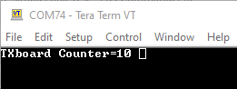

# [21D_SimpleLora_test](https://github.com/nBlocksStudioApps/21D_SimpleLoRa_test_FIRMWARE)
A project to test the Node [SimpleLoRa](https://github.com/nBlocksStudioNodes/nblocks_simplelora).

The Shematic Design repository is here: [21D_SimpleLoRa_test_SchDESIGN](https://github.com/nBlocksStudioApps/21D_SimpleLoRa_test_SchDESIGN)

## Design
We are using a multi board Design: Nodes 'A' are for the transmitting board and Nodes 'B' for the Receiving board.
The Transmitting board sends a new counter value every 5sec and the Receiving board prints that value to the serial port.

<!-- pagebreak -->

## Setup
n-Blocks PRO series boards allow fast and compact prototyping.
We are using 
 *  2x n-PRO-40 Lora boards
 *  2x n-PRO-24 pinstrip breakout boards
 *  1x n-PRO-DAP to connect the Receiver board to PC USB.

    

## Receiver 
The Receiver board is connected to PC terminal  via the n-PRO-DAP board USB interface. The received characters are printed in the screen. In every transmission we see the next value of the transmitted Counter content.

## RX and TX builds
Using the nBlocksStudio assist, we have created 2 builds, one for RX board and one for TX board. Each contains a binary file to be programmed to Microcontroller flash memory

 

<!-- pagebreak -->

## Flash programming
In this example we are using [SM32 ST-Link Utility](https://www.st.com/en/development-tools/stsw-link004.html) software to program the Microprocessor Flash memory. TX / RX board is programmed with the respective binary file  

<!-- pagebreak -->

## Radio current consumption during Transmission
The pulses, in below 2 images, are created from the TX current on a 10Ω shunt resistor on the power supply line of the TX board power.

The smaller (6 mA) current pulse is for 0 dBm and the larger (125 mA) for 20 dBm power

 

For this test the SimpleLora Node parameter `useleds` is set to `false` so the TX Led current does not disrupt the Radio transmission current measurement

## Time on air
The Transmission current consumption, [indicates] a time on air (Payload 20, SF 9) in the range of 320ms. From our tests, the time-on-air, is affected by the SimpleLora Node Payload parameter. As is also affected by the Spreading Factor.

----

For Payload=20 and Spreading factor SF=9 the Time on air is 320 ms  

 

----

For Payload=20 and  **SF=10** the Time on-air is 600 ms

----

For **Payload=64** and  SF=9 the Time on-air is 620 ms

----

A Transmitted payload > 64 Bytes, is reduced at reception to 20 Bytes

## Range testing

----

No errors in the tested range, with conditions:

> @ 0dBm transmission power and wire antenna @ length=86mm (1/4 wavelength):
 
 * Inside the house, tested all rooms: 5-15 meters
 * Receiver indoors and Transmitter in the garden: 40 meters  

----

   

 

----

## Tests
 *  TX every 5s :heavy_check_mark:
 *  TX every 1s :heavy_check_mark: 
 *  Receive and print the Transmitted Counter up to 100 :heavy_check_mark: 
 *  The printed message form and size, as expected :heavy_check_mark: 
 *  TX or RX Led is ON for 4ms :heavy_check_mark:
 *  TX_led (TX board) and RX_led (RX board) seem about synchronized to naked eye :heavy_check_mark:
 *  Time on Air changes with the Spreading Factor :heavy_check_mark:
 *  Receiver does not receive for different Spreading Factor in Transmission :heavy_check_mark:
 *  Receiver does receive for smaller Payload parameter in Transmission :heavy_check_mark:
*  Receiver does reduce a larger Payload parameter in Transmission :heavy_check_mark:
 *  Time on Air changes with the Payload :heavy_check_mark:
 *  Transmission current pulse is increased with the TX Power :heavy_check_mark:
*  Confirm Time on air with the LoRa Modem Calculator Tool :x:
*  Time on air change consistently with higher Coding Rate :x:
*  Range 40 meter no errors at 0 dBm wire antenna 1/4 wavelength:heavy_check_mark:

## Links
 *  [Semtech SX1276: Semtech SX1272 LoRa Calculator](https://www.semtech.com/products/wireless-rf/lora-transceivers/sx1276#download-resources)
 *  [airtime](https://www.loratools.nl/#/airtime)
 *  [ttn airtime calculator](airtime)